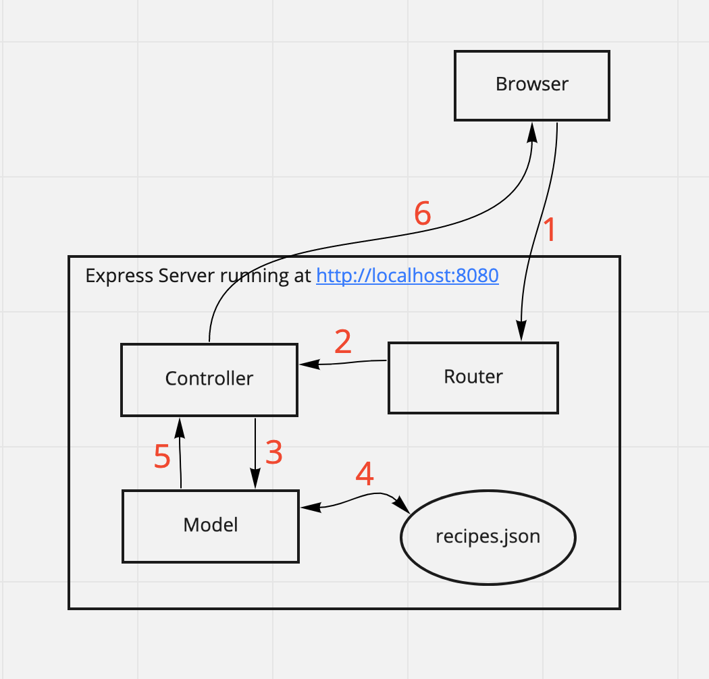

## Introduction

Welcome to the **fourth** part of the six-part [Introduction to Node.js tutorial series](/blog/introduction-to-node-js-tutorial-series-overview). By the end of this tutorial, you will be able to:

- Install and use Express to handle HTTP requests
- Build a RESTful API with Express
- Utilize the Node Package Manager (npm) to install and manage Node.js package dependencies

Some basic knowledge of server-side concepts is assumed.

## Tutorial Outline

- Express Overview
- Complete Example
- The Node Package Manager & Node Community
- Creating Your First Express Project
  - Task 1: Setup Your Project Folder
  - Task 2: Create a package.json File
  - Task 3: Install Project Dependencies
  - Task 4: Add a .gitignore File
  - Task 5: Create a Basic Express Server
- Implementing Routing
  - Task 6: Express Route Handler
  - Task 7: Dynamic Routes
  - ASIDE: Installing Nodemon
  - Task 8: Serving Static Assets
- Implementing Middleware
  - Task 9: Implement Application-Level Middleware
- Building a RESTful API with Express - `res.json()`
  - RESTful API Overview
  - JavaScript Object Notation (JSON) Overview
  - Task 10: Remove test code from `src/index.js`
  - Task 11: Use the `express.Router` class to Create Modular Route Handlers
  - Task 12: Implement a Route Handler for `GET /api/v1/recipes`
  - Task 13: Implement a Route Handler for `POST /api/v1/recipes`
  - Task 14 (**_CHALLENGE_**): Implement a Route Handler for `GET /api/v1/recipes/:id`
  - Task 15 (**_CHALLENGE_**): - Implement a Route Handler for `PUT /api/v1/recipes/:id`
  - Task 16 (**_CHALLENGE_**): Implement a Route Handler for `DELETE /api/v1/recipes/:id`
  - Task 17: Redirect the Base Url `/` to `/api/v1/recipes`
  - Task 18: Enable CORS
  - Task 19: Chain Route Handlers with `router.route()`
  - Task 20: Handle Errors Centrally
  - Task 21: Refactor the `recipes` Controller
- Other Node.js Frameworks & Tools
- Additional Resources
- Review
- Key Takeaways
- What's next

## Express Overview

Node.js is commonly used as a web server to serve up websites, JSON, and more. However, its syntax could be verbose. [Express](http://expressjs.com/) is a popular server-side framework for building web applications on Node.js.

Express provides a lightweight abstraction over the Node.js HTTP modules and convenience methods for creating routing, views, and middleware.

In this tutorial, you will build a RESTful API that allows API consumers to retrieve, create, update, and delete a set of recipes.

Along the way, you'll learn about `npm` and how to use `npm` to manage Node.js packages. You'll learn how to configure Express to return html templates as well as JSON data to the user. You'll also learn about RESTful design principles.

## Starter Code

There's no starter code for this tutorial. You will follow the steps described below to build the project from scratch.

## Complete Example

A Github repo with the complete code is available [here](https://github.com/intro-to-nodejs/express-recipes-complete).

Take a look at a [deployed version of the API here](https://evening-badlands-19313.herokuapp.com/).

## The Node Package Manager & Node Community

The [Node Package Manager](https://www.npmjs.com/)(or `npm` for short) consists of three distinct components:

- **_`npm` is the world's largest (JavaScript) software registry._** Open source developers from across the globe use `npm` to share and borrow packages, and many organizations use `npm` to manage private development as well.

  The large public database of packages means there's a package for almost everything! You can download and adapt these packages for your applications or incorporate them as they are.

  However, since anybody can publish a package to the `npm` registry, `npm` packages might not all be of the same quality. Often, there are dozens or even hundreds of packages with similar names and/or purposes, so it's important to select the most appropriate package for your project.

- **_`npm` also provides a user interface for managing your public and private packages_** and other aspects of your `npm` experience, like creating organizations to coordinate package maintenance and restricting code to specific developers.

- **_`npm` also refers to the command-line interface (CLI) tool for downloading and managing Node.js packages._** `npm` came bundled with your Node.js installation and is how most developers interact with the `npm` registry. While `npm` is the standard package manager for Node.js, there are other alternatives such as [`yarn`](https://yarnpkg.com/). In this tutorial, you will only be using `npm`.

### What criteria would you apply to select packages for your project?

When you use the search bar on the [`npm` website](https://www.npmjs.com) to find packages, it returns a list of packages which can be ranked by four criteria:

- **_Popularity_**: How popular is the package? If a package has thousands or even millions of downloads, that's probably a strong indicator that others have found the package to be useful. Check out [npm trends](https://www.npmtrends.com/) where you can compare the popularity of different comparable packages.

- **_Quality_**: What steps have the package creator/maintainer taken to ensure high quality? The presence of a `README` file, package stability, tests, and up-to-date dependencies are characteristics of a high quality package.

- **_Maintenance_**: How well-maintained is the package? Meaning is the package frequently updated to work well with other dependencies or new versions of the `npm` CLI?

- **_Optimality_**: How optimal is the package? Optimal combines the three criteria mentioned above (ie., popularity, quality, maintenance) into one meaningful score.

The `npm` search bar is powered by [npms and the npms analyzer](https://npms.io/about).

## Project Setup

Now, let's set up a new project. Along the way, you will learn about the `npm` CLI.

### Task 1: Setup Your Project Folder

1. Navigate to the folder where you'll like to store your new project.

1. Create a new directory called `express-recipes` (or use any name that you like) and change into it:

```sh
$ mkdir express-recipes
$ cd express-recipes
```

### Task 2: Create a `package.json` File

1.  Turn your project into an npm package by running the command:

```sh
$ npm init
```

**_What happens when you run the command above?_**

It loads a questionnaire containing a series of questions about how you would like to configure your package (e.g., project name, licenses, version, etc.).

Press `Enter` on every question to accept the defaults.

**_NOTE: If you ran `npm init --yes` instead, `npm` will create a default `package.json` using information extracted from the current directory. This option is seldom used, since developers often want to customize the manifest instead of using default values._**

A manifest file called `package.json` will be created:

```json:title=package.json
{
  "name": "starter-express-recipes",
  "version": "1.0.0",
  "description": "",
  "main": "index.js",
  "scripts": {
    "test": "echo \"Error: no test specified\" && exit 1"
  },
  "author": "",
  "license": "ISC"
}
```

The `package.json` file will specify versions of a package that your project can use, based on [semantic versioning rules](https://docs.npmjs.com/about-semantic-versioning). It also provides centralized configuration for tools (e.g., testing).

A `package.json` file **_must_** include the following fields:

- The `name` field which contains your package’s name, which must be lowercase and may contain hyphens and underscores (e.g., `my-express-package`). Try to choose a name that is unique, descriptive and meets [npm policy guidelines](https://www.npmjs.com/policies). Make sure it is not spelled in a similar way to another package name and will not confuse others about authorship.

- The `version` field must be in the `x.x.x` format and follow **semantic versioning** guidelines.

---

**_What is semantic versioning?_**

In the `npm` ecosystem, developers follow `npm`'s [semantic versioning guidelines](https://docs.npmjs.com/about-semantic-versioning) when updating their packages' version numbers.

Every time you make significant updates to an `npm` package, it is a best practice to publish a new version of the package with an updated version number in the `package.json` file for a few reasons:

- Having a consistent system for upticking project dependencies helps other developers understand the scope of changes in a given version and update their codebases as needed.
- Specifying an explicit version of a library also helps to keep everyone on the same exact version of a package, so that the whole team runs the same version until the `package.json` file is updated.

Semver (semantic versioning) relies on the `x.x.x` 3-digit format. The first, second, and third digits represent the major release, the minor release and the patch release, respectively.

Updated packages might contain only backward-compatible bug fixes (i.e., a patch release) or backward-compatible new features (i.e., a minor release), in which case the package could be incorporated presumably without much hassle.

Changes that break backward compatibility, on the other hand, would typically require a higher level of engineering planning and time to incorporate into the project.

Thanks to semver, you can easily specify any version of a package, or require a version higher or lower than what you need by using special symbols (e.g., `~`, `^`) in your `package.json`'s dependency list.

[`npm`'s semver calculator](https://semver.npmjs.com/) is a useful tool for defining appropriate acceptable package ranges for our project dependencies.

What do the `^`(aka carat or hat symbol) and `~`(aka tilde symbol) notations mean when defining package versions here?

```json:title=package.json
"dependencies": {
    "awesome_dep": "^0.13.0",
    "another_awesome_dep": "~5.2.0"
},
```

In your `package.json`, if you write:

- `~0.13.0`, patch releases will be updated when running `npm install`, meaning `0.13.1` is acceptable, but `0.14.0` is not.
- `^0.13.0`, patch and minor releases will be updated when running `npm install`, so `0.13.1`, `0.14.0` and so on are acceptable.
- `0.13.0`, that exact version will always be used. In other words, the dependency is locked.

---

**_What optional fields can be used in `package.json`?_**:

Other [optional fields](https://nodejs.dev/learn/the-package-json-guide) include, but are not limited to:

- `author`
- `contributors`
- `description`
- `main`
- `private`
- `scripts`
- `dependencies`
- `devDependencies`
- `engines`
- `browserslist`

You just created your first `npm` **package**!

When you hear the term **package**, it just refers to a file or directory that is described by a `package.json` file. To be published to the `npm` registry, a package must contain a `package.json` file.

### Task 3: Install Project Dependencies

1.  Install `express` in your project:

```sh
$ npm install express
```

**_What does running the above command create in your folder?_**

A new folder called `node_modules` is created.

It is the folder where `npm` installs the packages the project needs (i.e., dependencies).

The `express` package is installed in the current file tree, under the `node_modules` subfolder.

As this happens, `npm` also adds the `express` entry in the dependencies property of the `package.json` file present in the current folder.

Finally, a `package-lock.json` file is also created.

<details>
  <summary>
    What do you think is the purpose of the package-lock.json file?
  </summary>
  <a href="https://nodejs.dev/learn/the-package-lock-json-file">
    Nodejs: The Package Lock JSON File
  </a>
</details>

2.  To see the latest version of all the `npm` packages installed, including their dependencies, you can run:

    ```sh
    $ npm list
    ```

### Task 4: Add a `.gitignore` File

1. Generated code (e.g., `node_modules`) is typically not committed to Git, since they could take up a lot of space unncessarily. Additionally, sensitive environment variables should **not** be committed to Git. You can a `.gitignore` file in your root directory to specify which files or folders Git should ignore:

   ```sh
   $ touch .gitignore
   ```

   Add `node_modules` and `.env` to your `.gitignore` file, like this:

   ```title=.gitignore
   node_modules/
   .env
   ```

   Since the project dependencies are not committed to the Git repository, you might ask: How would other developers get these dependencies when they clone the project to their local machine?

   Keep in mind `package-lock.json` makes your build reproducible. Another developer could just run `npm install` on their local machine to install the dependencies listed in `package-lock.json`.

   In the next tutorial, you will store your environment variables in a file called `.env`. The `.env` file should not be commited to the Git repository because it will contain the authentication secret and other sensitive credentials for the API. So `.env` should be listed in the `.gitignore` file.

### Task 5: Create a Basic Express Server

1. Once the `express` package has been installed in `node_modules/` (along with other dependencies), you can now use it in your code. Since you will be creating multiple server-side files, you can organize the code that you write within a folder called `src` (a.k.a., the source folder). Then inside of the `src` folder, create a file called `index.js`:

   ```sh
   $ mkdir src
   $ touch src/index.js
   ```

1. Inside `src/index.js`, configure and set up an Express server, like this:

   ```js:title=src/index.js
   /*
   First, use the CommonJS require() function to
   import the Express module into the program
   */
   const express = require("express");

   /*
   Next, invoke express() to instantiate a new Express
   application
   */
   const app = express();

   // Finally, listen on port 8080 for incoming requests
   const port = process.env.PORT || 8080;

   app.listen(port, () => {
     // Log a message when the server is up and running
     console.log(`Server is up on port ${port}.`);
   });
   ```

   That's all it takes to create a basic Node.js server with Express!

1. To start your server, run:

   ```
   $ node src/index.js
   Server is up on port 8080.
   ```

   The Node.js process will stay running until you shut it down. You can always use `CTRL + c` to terminate the process, stop the server, and regain control of the terminal. If you need to run other CLI commands, then you'd have to start a new terminal window.

1. Try visiting `http://localhost:8080` in the browser.

   <details>
     <summary>What do you see?</summary>
     Cannot GET /
   </details>

## Implementing Routing

Our application is still missing **routing**!

**Routing** refers to how an application handles a client request to a particular endpoint. An endpoint consists of a **path** (e.g., `/hello` in `https://www.helloworld.com/hello`) and an **HTTP method** (i.e., `GET`, `PUT`, `POST`, `PATCH`,`DELETE`).

### Task 6: Express Route Handler

1.  Inside `src/index.js`, create a route handler after instantiating the Express application:

    ```js:title=src/index.js {6-8}
    const express = require("express");
    const app = express();

    // Route handler that sends a message to someone
    // visiting http://localhost:8080/
    app.get("/", (req, res) => {
     res.send("Hello Express Student!");
    });

    const port = process.env.PORT || 8080;

    app.listen(port, () => {
     console.log(`Server is up on port ${port}.`);
    });
    ```

    Let's break down the syntax here:

    - `app` refers to the instance of the Express server declared earlier at the top of the file.
    - `.get()` tells our Express server what HTTP method to listen for.
      - The first argument is the path to set up the handler for. This route path will match requests to the root route, `/`.
      - The second argument is a callback function that is executed when the path `/` is visited. The callback function accepts two arguments:
        - the first is the [HTTP request object](https://expressjs.com/en/5x/api.html#req) (conventionally referred to as `req`)
        - and the second is the [HTTP response object](https://expressjs.com/en/5x/api.html#res) (i.e., `res`) that an Express app sends to the client.
    - Calling [`res.send()`](http://expressjs.com/en/4x/api.html#res.send) in the route handler sends a message back as the response to the client.

    You should now have a working route!

1.  **Restart** the server and navigate to `http://localhost:8080/`. You should see the `Hello Express Student` message.

    <details>
      <summary>
        Besides `app.get()`, what other HTTP request methods do you think
        Express supports?
      </summary>
      Take a look <a href="http://expressjs.com/en/starter/basic-routing.html">
        here
      </a>.
    </details>

    Keep in mind Express provides a lightweight abstraction over the Node.js HTTP modules. You can compare and contrast the code you just wrote with the corresponding vanilla Node.js implementation below and notice how much less verbose Express makes your code:

    ```js
    const http = require("http");
    const hostname = "127.0.0.1";

    // http.createServer() creates a new HTTP server and returns it.
    const server = http.createServer((req, res) => {
      // Whenever a new request is received, the request event is called,
      // providing two objects: a request (req) and a response (res).
      res.statusCode = 200; // Set the statusCode property to 200 to indicate a successful response.
      res.setHeader("Content-Type", "text/plain");
      res.end("Hello Express Student!"); // close the response, adding the content as an argument to end():
    });

    const port = process.env.PORT || 8080;
    // The server is set to listen on the specified port and hostname.
    // When the server is ready, the callback function is called,
    // in this case informing us that the server is running.
    server.listen(port, hostname, () => {
      console.log(`Server running at http://${hostname}:${port}/`);
    });
    ```

### Task 7: Dynamic Routes

You can make your routes **dynamic**, meaning you can add parameters to your routes.

Route parameters are simply placeholders (similar to variables) in a URL. They always start with the `:` symbol. They allow you to customize your server's responses to an HTTP request.

1. Create a route handler that can accept a `name` parameter:

   ```js:title=src/index.js {8-10}
   const express = require("express");
   const app = express();

   app.get("/", (req, res) => {
    res.send("Hello Express Student!");
   });

   app.get("/:name", (req, res) => {
     res.send(`Welcome to Express Recipes, ${req.params.name}!`);
   });

   const port = process.env.PORT || 8080;

   app.listen(port, () => {
    console.log(`Server is up on port ${port}.`);
   });
   ```

   You can now access the `:name` route parameter as a key inside the `req.params` object. Our greeting is more personal!

1. **Restart** your server. What do you see when you visit `http://localhost:8080/intuit`? You should see the message `Welcome to Express Recipes, intuit!`.

## Installing Nodemon

Notice that you'd have to manually restart the server every time you make a code change, which is annoying and time-consuming.

Enter [Nodemon](https://www.npmjs.com/package/nodemon), a development tool that monitors Node.js applications and automatically restarts the server whenever it detects file changes.

1. Install the nodemon package globally:

   ```
   $ npm install -g nodemon

   ```

   A global installation is performed using the `-g` flag. Installing a package globally allows a package to be used across all of Node.js applications. The package won't be included in the project dependency, but instead, it will be installed in a global location on your machine.

   The `npm root -g` command will tell you where that exact location is on your machine.

   On macOS or Linux, this location could be `/usr/local/lib/node_modules`.

   On Windows, it could be `C:\Users\YOU\AppData\Roaming\npm\node_modules`.

   If you use `nvm` to manage Node.js versions, however, note that the location would differ.

   I, for example, use nvm. My packages location was shown as `/Users/houchia/.nvm/versions/node/v14.2.0/lib/node_modules`.

1. Stop any server that's currently running. Then, start up the Express application with the `nodemon` command:

   ```
   $ nodemon index.js
   ```

1. Try making a change inside `index.js`, for example, changing the greeting. Check the terminal that is running the server - you should see that the server automatically restarted.

1. But it'd be a hassle to have to remember that long command every time you want to start the server. Let's update the `start` script in the `package.json` file to run this command:

```json
"start": "nodemon src/index.js --ignore ./db"
```

The `--ignore ./db` option tells nodemon to ignore changes to the `/db` folder, which you will add later on. The `/db` folder will contain the API data. By ignoring changes to the `/db` folder, nodemon will **not** restart the server every time data is added, removed or updated inside the `/db` folder.

Now, whenever you need to start the server, you can just run `npm run start`, where `start` is the name of the script you'd like to execute.

### Task 8: Serving Static Assets

Express can serve up all the assets needed for your website, including HTML, CSS, JavaScript, images, fonts and more.

You just need to tell Express the path to the directory it should serve. Here are the tasks:

1. Create a `public/` folder in your project root and add an `index.html` file and a `styles.css` file to it.

   ```html:title=public/index.html
   <!DOCTYPE html>
   <html lang="en">
     <head>
       <meta charset="UTF-8" />
       <meta name="viewport" content="width=device-width, initial-scale=1.0" />
       <link rel="stylesheet" href="styles.css" />
       <title>Express Recipes</title>
     </head>
     <body>
       <h1>Welcome to Express Recipes</h1>
     </body>
   </html>
   ```

   ```css:title=public/styles.css
   h1 {
     color: blue;
   }
   ```

1. Configure the Express server to serve content stored in the `public/` folder:

   ```js:title=src/index.js {2,6-7}
   const express = require("express");
   const path = require('path');

   const app = express();

   const publicDirectoryPath = path.join(__dirname, './public');
   app.use(express.static(publicDirectoryPath));

   app.get("/", (req, res) => {
    res.send("Hello Express Student!");
   });

   app.get("/:name", (req, res) => {
     res.send(`Welcome to Express Recipes, ${req.params.name}!`);
   });

   const port = process.env.PORT || 8080;

   app.listen(port, () => {
    console.log(`Server is up on port ${port}.`);
   });
   ```

   Let's break down the syntax above:

   - First, import `Node.js`’s [`path`](https://nodejs.org/dist/latest-v11.x/docs/api/path.html) module, which is needed to generate the absolute path to the `public/` folder.
   - Next, construct the absolute path to the `public/` folder. The call to `path.join` allows you to create an absolute path by combining individual path segments. It combines `__dirname`, which is the directory path for the current script, with the relative path to the `public/` folder. Note that if any site assets are not in the `public/` folder, then they're not public and the browser won't be able to load them.
   - Finally, register a [middleware function](#implementing-middleware) using `app.use()`. Within `app.use()`, call [`express.static()`](https://expressjs.com/en/starter/static-files.html), which is a built-in middleware function that serves static assets included in the `public/` directory to the client.

1. Navigate to `http://localhost:8080`. You should see the `index.html` page!

## Implementing [Middleware](http://expressjs.com/th/guide/using-middleware.html)

You used a middleware function, `express.static()`, in the previous section to serve static files to the client. You can use middleware functions for a variety of tasks, such as logging, authentication, parsing form data, etc.

Middleware functions are functions that alter the `request` (`req`) and `response` (`res`) object(s) in the application's request-response cycle:

**New HTTP Request --> Middleware Functions --> Route Handlers**

Middleware functions should accept three parameters: `req`, `res`, and `next`. They are executed in a specific order. When the current middleware function is done, it will pass control to the next middleware function in the stack by calling `next()`.

If you don't call `next()` inside a middleware function, the route handlers that come after the middleware function will **_NOT_** run!

### Task 9: Implement Application-Level Middleware

Let's create a simple logging middleware to print information about **_every_** incoming request.

1. Add the following middleware before the route handlers:

   ```js:title=src/index.js {6-12}
   const express = require("express");
   const path = require('path');

   const app = express();

   app.use((req, res, next) => {
     const { method, path } = req;
     console.log(
       `New request to: ${method} ${path} at ${new Date().toISOString()}`
     );
     next();
   });

   const publicDirectoryPath = path.join(__dirname, './public');
   app.use(express.static(publicDirectoryPath));

   app.get("/", (req, res) => {
   res.send("Hello Express Student!");
   });

   app.get("/:name", (req, res) => {
    res.send(`Welcome to Express Recipes, ${req.params.name}!`);
   });

   const port = process.env.PORT || 8080;

   app.listen(port, () => {
    console.log(`Server is up on port ${port}.`);
   });
   ```

   Let's break down the syntax above:

   - `app.use()` sets up a middleware function. Because a mount path is **not** passed as the first argument, the function will be executed every time the app receives a request.
   - The callback function passed to `app.use()` logs information about the incoming request and finally calls `next()`.
   - Calling `next()` passes control to the middleware that follows the current middleware, which in this case is the middleware that serves static files from the `public/` folder.

1. Try navigating to `http://localhost:8080/`. What do you see in the console? You should see the message `New request to: GET...`.

You'll add more middleware functions later on but for now, this is all you need. If you're curious about other ways to incorporate middleware functions, take a [read here](https://expressjs.com/en/guide/using-middleware.html).

At this point, you have a basic Express server capable of serving static assets and handling a basic HTTP GET request!

## Building a RESTful API with Express - `res.json()`

Let's implement a simplified Express API, `Express Recipes`, that serves recipes data via JSON over HTTP. The request-response cycle below traces how a user's `GET` request would flow through the `Express Recipes` application.



**Note that in the diagram above, `model` should say `service` **

To keep the API code organization easy to understand, maintain and modify, you will structure and write modular code using three main layers, namely the **router**, **controller**, and **service**.

The **router** for a given resource is responsible for routing requests to the appropriate controller based on the URL.

The **controller** for a given resource defines the logic for handling each route and is responsible for manipulating the state of a resource in the API as well as sending back a response (either successful or not) to the client.

The **service** encapsulates or groups together the functions that perform a specific category of tasks in an application, like making CRUD transactions for a given resource. Services make code DRY because the functions defined in a service can be reused throughout the application.

Overall, structuring and layering your code this way would lead to better modularization, encapsulation, and separation of concerns in your codebase.

Here are the steps involved in the request-response cycle:

1. The browser sends a `GET` request for all the recipes.
1. The `router` maps the HTTP request to the corresponding `controller` for handling.
1. The `controller` receives the HTTP request and asks the `service` to fetch data from storage.
1. The `service` loads the data from `recipes.json`.
1. The `service` returns data to the `controller`.
1. The `controller` sends JSON data back to the browser.

Keep this mental model in mind for the rest of the tutorial since you will be writing code to implement each part of this diagram, including the router, controller, and service for the `recipes` resource.

### RESTful API Overview

An API allows clients to access data on a server. [Representational Transfer State (`REST`)](https://restfulapi.net/) is a popular architectural convention for structuring and naming APIs using a standardized protocol, such as the Hyper-Text Transfer Protocol (`HTTP`) standard.

A `REST API` based on the `HTTP` standard leverages five main `HTTP` methods to retrieve and manipulate data. Each method corresponds to a **C**reate, **R**ead, **U**pdate, **D**elete (CRUD) operation.

| HTTP Method | CRUD functionality | Database Action      |
| ----------- | ------------------ | -------------------- |
| GET         | read               | retrieve data        |
| POST        | create             | add data             |
| PUT         | update             | modify existing data |
| PATCH       | update             | modify existing data |
| DELETE      | delete             | delete existing data |

**_DISCUSS_**:

<details>
  <summary>What is the difference between `PUT` and `PATCH`?</summary>
  `PATCH` is replacing part of the data and `PUT` is replacing the whole thing. For
  example, when updating a user profile, `PUT` completely replaces the profile in
  the database, whereas `PATCH` changes a few fields of the profile.
</details>

The `Express Recipes` API will support the following RESTful endpoints:

| HTTP Method | Path                | Action                                                       |
| ----------- | ------------------- | ------------------------------------------------------------ |
| GET         | `/api/v1/recipes`   | Read information about all recipes                           |
| POST        | `/api/v1/recipes`   | Create a new recipe                                          |
| GET         | `/api/v1/recipes/1` | Read information about the recipe with ID of 1               |
| PUT         | `/api/v1/recipes/1` | Update the existing recipe with ID of 1 with all new content |
| DELETE      | `/api/v1/recipes/1` | Delete the existing recipe with ID of 1                      |

Note that it is a best practice to version your endpoints (i.e., `/api/v1`) so that you can maintain compatibility with older services while continuing to improve your API.

### JavaScript Object Notation (JSON) Overview

Let's review what JSON is.

HTTP sends data as strings.

However, you often want to pass structured data (i.e., arrays and objects) between web applications.

In order to do so, native data structures are serialized: converted from a javascript object into a string representation of the data (aka serialization), using the "JavaScript Object Notation" (`JSON`) format.

This `JSON` string can be transmitted over the internet and then parsed back into data (i.e., de-serialized) once it reaches its destination (e.g., the browser).

Because `JSON` is easy-to-read, light-weight and easy-to-parse, it has become a universal standard for transmitting data across the web.

`JSON` Example:

```json
{
  "owners": [
    { "name": "Hou", "id": 1 },
    { "name": "Tim", "id": 2 }
  ],
  "restaurantLocation": "This is a an address"
}
```

While it is possible to transfer data using other formats (e.g., `XML`) and there are pros and cons to different approaches, you will only use `JSON` for this tutorial.

### Task 10: Remove test code from `src/index.js`

1.  Now that you're ready to start building the API, let's remove any code that is not needed to build the API:

    ```diff:title=src/index.js
    const express = require("express");
    const path = require('path');

    const app = express();

    app.use((req, res, next) => {
      const { method, path } = req;
      console.log(
      `New request to: ${method} ${path} at ${new Date().toISOString()}`
      );
      next();
    });

    - const publicDirectoryPath = path.join(\_\_dirname, './public');
    - app.use(express.static(publicDirectoryPath));

    - app.get("/", (req, res) => {
    -  res.send("Hello Express Student!");
    - });

    - app.get("/:name", (req, res) => {
    -  res.send(`Welcome to Express Recipes, ${req.params.name}!`);
    - });

    const port = process.env.PORT || 8080;

    app.listen(port, () => {
      console.log(`Server is up on port ${port}.`);
    });

    ```

### Task 11: Use the `express.Router` class to Create Modular Route Handlers

1.  Right now, the `src/index.js` file is pretty cluttered, since it includes all the code needed for server setup and initialization, middleware processing and route handling.

    To maintain better separation of concerns and modularity in the codebase, let's move the API routing logic to a separate folder called `routers` inside the `src` folder:

    ```shell
    $ mkdir src/routers
    $ touch src/routers/recipes.js
    ```

1.  Inside `src/routers/recipes.js`, create a [router instance](https://expressjs.com/en/guide/routing.html#express-router) and export the module:

    ```js:title=src/routers/recipes.js
    const express = require("express");

    const router = express.Router();

    // You'll add route handlers here in subsequent tasks

    // Export the router
    module.exports = router;
    ```

    `express.Router()` creates a Router instance, which is like a mini Express app that runs its own complete middleware and routing system, and is responsible for routing a single given API resource (e.g., `recipes` data). This router module can be attached to the main Express app defined in `src/index.js`. If your API needs to manage multiple resources, then you can create multiple router instances to manage the routing for each resource.

1.  Inside `src/index.js`, load the router module at the top and mount the recipes router at the `/api/v1/recipes`, like this:

    ```diff:title=src/index.js {4,16}
    const express = require("express");
    const path = require('path');

    const recipesRouter = require('./routers/recipes');

    const app = express();

    app.use((req, res, next) => {
      const { method, path } = req;
      console.log(
      `New request to: ${method} ${path} at ${new Date().toISOString()}`
      );
      next();
    });

    app.use('/api/v1/recipes', recipesRouter);

    const port = process.env.PORT || 8080;

    app.listen(port, () => {
      console.log(`Server is up on port ${port}.`);
    });
    ```

    The middleware `app.use('/api/v1/recipes', recipesRouter)` will route any path matching `/api/v1/recipes` to the recipes router.

### Task 12: Implement a Route Handler for GET `/api/v1/recipes`

Keep in mind after an incoming request has been matched to a controller, the controller will call the appropriate method from the service layer to interact with the database, so you'd need to implement the controller and service layers next.

1. For simplicity, you will store the API data in a JSON file. Create a folder called `db` in the project root. Inside the `db` folder, create a new file called `recipes.json`.

1. You will rely on the `fs.promises` API to perform **_CRUD_** operations on the recipes data.

   Copy and paste the contents of `recipes.json` from this [commit](https://github.com/intro-to-nodejs/express-recipes/commit/a69c22d63db5981ddd31d27ed4e7c222e637f702) into your `/db/recipes.json` file. This will be the starter data set for the `Express Recipes` API.

1. Inside the `src` folder, create a folder called `services` and within the `services` folder, create a file called `recipes.js`. Then add the following code:

   ```js:title=src/services/recipes.js
   const fs = require("fs").promises;
   const path = require("path");

   const recipesFilePath = path.join(__dirname, "../../db/recipes.json"); // Contruct the path to the recipes data

   const getAll = async () => JSON.parse(await fs.readFile(recipesFilePath));

   module.exports = {
    getAll,
   };
   ```

   Line 1 imports the `fs` methods that return Promise objects so that you can use the `async`/`await` pattern in your service later. The `getAll()` method reads, parses, and returns the contents of the `db/recipes.json` file.

1. Inside the `src` folder, create a folder called `controllers` and within it, create a file called `recipes.js`. Implement the `getAll` route handler inside this file:

   ```js:title=src/controllers/recipes.js
   const service = require("../services/recipes");

   const getAll = async (req, res, next) => {
     try {
       res.json({ data: await service.getAll() });
     } catch (error) {
       next(error);
     }
   };

   module.exports = {
    getAll,
   };
   ```

   Note that the route handler is passed a `next` argument, which can be used to handle errors caught in the try/catch block. You will handle these errors at the end of the tutorial.

1. Back in the recipes router, import and mount the router handler on the `/` path, like this:

   ```js:title=src/routers/recipes.js {4,6}
   const express = require("express");
   const router = express.Router();

   const { getAll } = require("../controllers/recipes");

   router.get("/", getAll);

   module.exports = router;
   ```

1. Navigate to `http://localhost:8080/api/v1/recipes`. You should be getting back an object that contains all the recipes stored in the `data` property!

### Task 13: Implement a Route Handler for `POST /api/v1/recipes`

You've already seen an example of a built-in middleware when you used the `express.static()` method earlier on to serve static assets to the client.

A common server task is to handle form data or JSON submitted via a `POST` request. However, by default, Express does NOT know how to handle certain types of requests (e.g., a `POST` request that contains JSON data in the request body) unless we call specific middlewares.

Let's take a look at two widely-used built-in middlewares:

- [`express.json()`](http://expressjs.com/en/4x/api.html#express.json)
- [`express.urlencoded()`](http://expressjs.com/en/4x/api.html#express.urlencoded)

1.  Add the `express.json()` middleware to parse JSON data and make it accessible in the request object (via `req.body`).

    Also add the `express.urlencoded()` middleware to parse incoming requests with URL-encoded payloads.

    ```js:title=src/index.js {16,17}
    const express = require("express");
    const path = require('path');

    const recipesRouter = require('./routers/recipes');

    const app = express();

    app.use((req, res, next) => {
      const { method, path } = req;
      console.log(
      `New request to: ${method} ${path} at ${new Date().toISOString()}`
      );
      next();
    });

    app.use(express.json());
    app.use(express.urlencoded({ extended: true }));

    app.use('/api/v1/recipes', recipesRouter);

    const port = process.env.PORT || 8080;

    app.listen(port, () => {
      console.log(`Server is up on port ${port}.`);
    });

    ```

1.  In the recipes service, implement a `save()` method to save a new recipe to the database, like this:

    ```js:title=src/services/recipes.js {8-21,25}
    const fs = require("fs").promises;
    const path = require("path");

    const recipesFilePath = path.join(__dirname, "../../db/recipes.json"); // Contruct the path to the recipes data

    const getAll = async () => JSON.parse(await fs.readFile(recipesFilePath));

    const save = async (recipe) => {
      // Get all recipes from the database
      const recipes = await getAll();

      recipe.id = recipes.length + 1; // Not a robust incrementor mechanism; don't use in production!

      // Push the new recipe into the current list of recipes
      recipes.push(recipe);

      // Save all recipes to the database
      await fs.writeFile(recipesFilePath, JSON.stringify(recipes));

      return recipe;
     };

    module.exports = {
     getAll,
     save
    };
    ```

1.  In the recipes controller, implement a `save()` route handler for `POST` requests to `api/v1/recipes`:

    ```js:title=src/controllers/recipes.js {11-36,40}
    const service = require("../services/recipes");

    const getAll = async (req, res, next) => {
      try {
        res.json({ data: await service.getAll() });
      } catch (error) {
        next(error);
      }
    };

    const save = async (req, res, next) => {
      try {
        // Extract only the data that is needed from the request body
        const {
          name,
          healthLabels,
          cookTimeMinutes,
          prepTimeMinutes,
          ingredients,
        } = req.body;

        // Format the new recipe you want to save to the database
        const newRecipe = {
          name,
          healthLabels: [...healthLabels], // make a copy of the `healthLabels` array to store in the db
          cookTimeMinutes,
          prepTimeMinutes,
          ingredients: [...ingredients], // make a copy of the `ingredients` array to store in the db
        };

        // Respond with a 201 Created status code along with the newly created recipe
        res.status(201).json({ data: await service.save(newRecipe) });
      } catch (error) {
        next(error);
      }
    };

    module.exports = {
      getAll,
      save
    };
    ```

    Note that in a real app, you'd probably do more extensive validation of the user-submitted data stored in the `req.body` to ensure it does not contain unexpected (e.g., missing or invalid parameters), or even malicious input. That is, however, beyond the scope of this tutorial.

1.  Back in the recipes router, import and mount the `save()` router handler on the `/` path, like this:

    ```js:title=src/routers/recipes.js {4,7}
    const express = require("express");
    const router = express.Router();

    const { getAll, save } = require("../controllers/recipes");

    router.get("/", getAll);
    router.post("/", save);

    module.exports = router;
    ```

1.  Test out the route with [Postman](https://www.postman.com/downloads/)!

    First, [download Postman](https://www.postman.com/downloads/).

    Then, watch this [short video](https://www.youtube.com/watch?v=t5n07Ybz7yI&feature=youtu.be) on how to make a `POST` request with Postman.

    To configure and send a HTTP request with Postman:

    1. Select `POST` as the HTTP method and enter the url for the `POST /api/v1/recipes` endpoint.
    1. In the `Headers` tab, set `Content-Type` to `application/json` to tell the server that JSON data is being sent over.

       Here's what your configuration should look like:

       

    1. Next, in the `Body` tab, select `raw` and add the following data to the request body:

       ```json
       {
         "name": "Edamame recipes",
         "healthLabels": [
           "Sugar-Conscious",
           "Vegan",
           "Vegetarian",
           "Peanut-Free",
           "Tree-Nut-Free",
           "Alcohol-Free"
         ],
         "cookTimeMinutes": 127,
         "prepTimeMinutes": 20,
         "ingredients": [
           "salt",
           "1 one-pound bag edamame",
           "1 teaspoon Seasoned Salt"
         ]
       }
       ```

       Here's what your configuration for this task should look like:

       

    1. Hit `Send`.

    1. If all goes well, you should get back a `201 Created` response:

       

    1. Finally, check the `db/recipes.json` file to see if a new recipe has been added (towards the end of the file).

### Task 14 (**_CHALLENGE_**): Implement a Route Handler for `GET /api/v1/recipes/:id`

Let's allow the API consumer to retrieve a recipe by `id`. Don't forget to test your endpoint with Postman!

<details>
  <summary>SOLUTION</summary>
  <a href="https://github.com/intro-to-nodejs/express-recipes-complete">
    Solution Repo
  </a>
</details>

### Task 15 (**_CHALLENGE_**): - Implement a Route Handler for `PUT /api/v1/recipes/:id`

Let's allow the API consumer to update a recipe by id. Don't forget to test your endpoint with Postman!

<details>
  <summary>SOLUTION</summary>
  <a href="https://github.com/intro-to-nodejs/express-recipes-complete">
    Solution Repo
  </a>
</details>

### Task 16 (**_CHALLENGE_**): Implement a Route Handler for `DELETE /api/v1/recipes/:id`

Let's allow the API consumer to delete a recipe by id. Don't forget to test your endpoint in Postman!

<details>
   <summary>
      SOLUTION
   </summary>
<a href="https://github.com/intro-to-nodejs/express-recipes-complete">
  Solution Repo
</a>

The `.sendStatus()` method sets the response HTTP status code and sends the
response. It's customary to return [204 No
Content](https://developer.mozilla.org/en-US/docs/Web/HTTP/Methods/DELETE) to
indicate successful application of the `DELETE` method.

</details>

### Task 17: Redirect the Base Url `/` to `/api/v1/recipes`

Let's make the API a bit more user-friendly by redirecting any requests to `/` to `/api/v1/recipes`, where all our routes are defined. You can use the `res.redirect()` method to redirect requests to a different desired path, which is passed as an argument to the method.

In the `src/index.js` file, add a route handler above the recipes router, like this:

```js:title=src/index.js {19-21}
const express = require("express");
const path = require('path');

const recipesRouter = require('./routers/recipes');

const app = express();

app.use((req, res, next) => {
  const { method, path } = req;
  console.log(
  `New request to: ${method} ${path} at ${new Date().toISOString()}`
  );
  next();
});

app.use(express.json());
app.use(express.urlencoded({ extended: true }));

app.get("/", (req, res) => {
  res.redirect("/api/v1/recipes");
});

app.use('/api/v1/recipes', recipesRouter);

const port = process.env.PORT || 8080;

app.listen(port, () => {
  console.log(`Server is up on port ${port}.`);
});
```

Once the browser receives a redirect, it performs a GET request to the `/api/v1/recipes` endpoint instead.

### Task 18: Enable CORS

You can use third-party middleware to add functionality to Express apps, including support for Cross Origin Resource Sharing, or [`CORS`](https://developer.mozilla.org/en-US/docs/Web/HTTP/CORS) for short.

By default, any requests that come from an origin other than `localhost:8080` (e.g., `mysite.com`, `facebook.com`) will be blocked, as the Express server is currently running on `localhost:8080` and so would only allow requests sent from that origin.

So if a website that's hosted on a different origin tries to make `GET` requests to a server at `http://localhost:8080`, the requests would be blocked unless the website is added to a `CORS` whitelist in Express.

The `npm` package `cors` is a middleware that allows you to configure `CORS` in Express applications with various options. By default, the `cors` package just enables resource sharing and access for **ALL** origins.

1. Install `cors` by running:

   ```
   $ npm install cors --save
   ```

1. Inside `src/index.js`, call the `cors` middleware as part of the server setup:

```js:title=src/index.js {3,9}
const express = require("express");
const path = require('path');
const cors = require("cors");

const recipesRouter = require('./routers/recipes');

const app = express();

app.use(cors());

app.use((req, res, next) => {
  const { method, path } = req;
  console.log(
  `New request to: ${method} ${path} at ${new Date().toISOString()}`
  );
  next();
});

app.use(express.json());
app.use(express.urlencoded({ extended: true }));

app.get("/", (req, res) => {
  res.redirect("/api/v1/recipes");
});

app.use('/api/v1/recipes', recipesRouter);

const port = process.env.PORT || 8080;

app.listen(port, () => {
  console.log(`Server is up on port ${port}.`);
});
```

1. **BONUS:** Create a whitelist of domains that are allowed to access our recipes. See the [docs](https://expressjs.com/en/resources/middleware/cors.html).

Congratulations! You now have a fully working API!

### Task 19: Chain Route Handlers with `router.route()`

1. You can use `router.route()` to chain route handlers that share the same route path.

   ```diff:title=src/routers/recipe.js
   const express = require('express');
   const router = express.Router();

   const {
    deleteRecipe,
    getAllRecipes,
    getRecipe,
    saveRecipe,
    updateRecipe,
   } = require('../controllers/recipe');

   - router.get('/', getAllRecipes);
   - router.post('/', saveRecipe);
   - router.get('/:id', getRecipe);
   - router.put('/:id', updateRecipe);
   - router.delete('/:id', deleteRecipe);

   + // Route `GET` and `POST` HTTP requests for `/`
   + router.route('/').get(getAllRecipes).post(saveRecipe);
   +
   + // Route `GET`, `PUT`, and `DELETE` HTTP requests for `api/v1/recipes/:id`
   + router.route('/:id').get(getRecipe).put(updateRecipe).delete(deleteRecipe);

   module.exports = router;
   ```

## Task 20: Handle Errors Centrally

Express comes with a [default built-in error handler](https://expressjs.com/en/guide/error-handling.html) which handles any errors that might arise in the application.

Since you have not written custom error handlers to handle the errors passed to `next()` in `src/controllers/recipe.js`, the errors will be handled by the built-in error handler.

Let's see what the default handler does.

Visit a faulty path `http://localhost:8080/api/v1/recipes/9999` (i.e., where recipe with `id` of 9999 does not exist) and take a look at the error displayed in the browser:


As you can see, the error is written to the client with the stack trace in development mode. For security purposes, the stack trace is not exposed in the production environment. This is what the same error would look like in production:


As you can see, the error message is neither descriptive nor helpful for the client!

You can create a custom error handler to fix that. To avoid duplicating the code for error handling, you can also create a helper method to handle errors centrally in the application.

1. Create a directory called `utils` with `src/`. Inside the `utils` directory, create a file called `error.js`:

   ```
   $ mkdir src/utils
   $ touch src/utils/error.js
   ```

1. The built-in Node.js `Error` class contains important information about application errors (e.g., stack traces), so let's define a custom error class that inherits from it:

   ```js:title=src/utils/error.js
   class CustomError extends Error {
     constructor({ statusCode, message }) {
       super(); // inherit properties and methods from the built-in Error class
       this.statusCode = statusCode; // define a custom status code for the error
       this.message = message; // define a custom message for the error
     }
   }

   module.exports = {
     CustomError,
   };
   ```

1. Inside `src/utils/error.js`, define an error-handling middleware to handle errors in the application, right below the `CustomError` class:

   ```js:title=src/utils/error.js
   const handleError = (err, req, res, next) => {
     let { statusCode, message } = err;

     // Log error message in our server's console
     console.error(message);

     // If no status code is specified, set it to 'Internal Server Error (500)'
     if (!statusCode) statusCode = 500;

     // Send back an error with valid HTTP status code and message
     res.status(statusCode).json({
       status: "error",
       statusCode,
       message,
     });
   };

   module.exports = {
     handleError,
     CustomError,
   };
   ```

   Note that an error-handling function has four arguments instead of three: `(err, req, res, next)` and will only get called if an error occurs.

1. Inside `src/index.js`, import `handleError` at the top of the file and call it last, after all other `app.use()` and route calls, like this:

   ```js:title=src/index.js {6,29}
   const express = require("express");
   const path = require('path');
   const cors = require("cors");

   const recipesRouter = require('./routers/recipes');
   const { handleError } = require('./utils/error');

   const app = express();

   app.use(cors());

   app.use((req, res, next) => {
     const { method, path } = req;
     console.log(
     `New request to: ${method} ${path} at ${new Date().toISOString()}`
     );
     next();
   });

   app.use(express.json());
   app.use(express.urlencoded({ extended: true }));

   app.get("/", (req, res) => {
     res.redirect("/api/v1/recipes");
   });

   app.use('/api/v1/recipes', recipesRouter);

   app.use(handleError);

   const port = process.env.PORT || 8080;

   app.listen(port, () => {
     console.log(`Server is up on port ${port}.`);
   });
   ```

1. Visit the faulty path `http://localhost:8080/api/v1/recipes/9999` again. You should see the following:
   

## Task 21: Refactor the `recipes` Controller

You can find the commit for this refactoring exercise [here](https://github.com/intro-to-nodejs/express-recipes-complete/commit/b56821b3b23df1819504515d6e8814e8d3584ca4).

Currently, `get()`, `update()`, and `remove()` route handlers repeat the following chunk of logic to check that a recipe exists in the database and to throw an error if the recipe does not exist:

```js
const recipe = await service.get(req.params.id);

if (recipe === undefined) {
  const err = new Error("Recipe not found");
  err.statusCode = 404;
  throw err;
}
```

To avoid duplicating the logic across controllers, you can move the validation logic into a middleware function. Inside `src/controllers/recipes.js`, add a middleware function called `recipeExists()`, like this:

```js
const recipeExists = async (req, res, next) => {
  const recipe = await service.get(req.params.id);

  if (recipe === undefined) {
    const err = new Error("Recipe not found");
    err.statusCode = 404;
    next(err);
  } else {
    res.locals.recipe = recipe;
    next();
  }
};
```

Here, `recipeExists()` calls `next()` with an error object if the recipe isn't found. If the recipe is found, it is stored in a special [`locals`](https://expressjs.com/en/5x/api.html#res.locals) property that exists on the `res` object. The `locals` property is used to store intermediate data that are only available for the lifetime of the request.

Next, remove the validation logic from the `get()`, `update()`, and `remove()` route handlers, like this:

`get()`:

```js:title=src/controllers/recipes.js
const get = async (req, res, next) => {
  try {
    res.json({ data: res.locals.recipe });
  } catch (error) {
    next(error);
  }
};
```

`update()`:

```diff:title=src/controllers/recipes.js
const update = async (req, res, next) => {
  try {
-    const recipe = await service.get(req.params.id);

-    if (recipe === undefined) {
-      const err = new Error("Recipe not found");
-      err.statusCode = 404;
-      throw err;
-    }
-
    const {
      name,
      healthLabels,
      cookTimeMinutes,
      prepTimeMinutes,
      ingredients,
    } = req.body;

    const updated = await service.update(req.params.id, {
      name,
      healthLabels: [...healthLabels],
      cookTimeMinutes,
      prepTimeMinutes,
      ingredients: [...ingredients],
    });

    res.json({ data: updated });
  } catch (error) {
    next(error);
  }
};

```

`remove()`:

```diff:title=src/controllers/recipes.js
const remove = async (req, res, next) => {
  try {
-    const recipe = await service.get(req.params.id);

-    if (recipe === undefined) {
-      const err = new Error("Recipe not found");
-      err.statusCode = 404;
-      throw err;
-    }
-
    await service.remove(req.params.id);
    res.sendStatus(204);
  } catch (error) {
    next(error);
  }
};
```

Next, update the exported route handlers to include the `recipeExists()` middleware, like this:

```js
module.exports = {
  getAll,
  get: [recipeExists, get],
  save,
  update: [recipeExists, update],
  remove: [recipeExists, remove],
};
```

Finally, test your API endpoints in Postman to ensure they are still working as expected. You can write automated tests for your API using a library like [Supertest](https://www.npmjs.com/package/supertest).

Now you know how to build a modular Express API with basic validation and centralized error handling.

## Other Node.js Frameworks & Tools

- [AdonisJS](https://adonisjs.com/)
- [Fastify](https://www.fastify.io/)
- [hapi](https://hapi.dev/)
- [koa](https://koajs.com/)
- [Loopback](https://loopback.io/)
- [Meteor](https://www.meteor.com/)
- [Micro](https://github.com/zeit/micro)
- [NestJS](https://nestjs.com/)
- [Next.js](https://nextjs.org/)
- [Nx](https://nx.dev/)

## Additional Resources

- [REST API Design](https://restfulapi.net/rest-api-design-tutorial-with-example/)
- [Advanced Node.js Error Handling](https://www.toptal.com/nodejs/node-js-error-handling)

## Review

Take a moment to reflect on what you’ve learned in this tutorial and answer the following questions:

- What is Express?
- What is `npm`?
- What is the purpose of a middleware? What are some examples of built-in middlewares in Express?
- What is a RESTful API? What are some data formats supported by a RESTful API?
- Why would you use the `express.Router` class?

## Key takeaways

- Express is minimalistic and provides a lightweight abstraction over the Node.js HTTP modules and convenience methods for creating routing, views, and middleware.

- `npm ` stands for Node Package Manager. It is the world's largest JavaScript software registry. `npm` also refers to the command-line interface (CLI) tool for downloading and managing Node.js packages.

- Middleware functions are functions that alter the request (req) and response (res) object(s) in the application's request-response cycle:

  **New HTTP Request --> Middleware Functions --> Route Handlers**

  They can be used for a variety of tasks, such as logging, authentication, parsing form data, etc.

  Examples of built-in middlewares include `express.static()`, which serves static assets to the client, and express.json(), which parses JSON data and makes it accessible in the request object (via `req.body`).

- REST is a popular architectural convention for structuring and naming APIs using a standardized protocol, such as the HTTP standard. A RESTful API based on the HTTP standard leverages five main HTTP methods (i.e., `GET`, `PUT`, `POST`, `PATCH`, `DELETE`) to retrieve and manipulate data. Each method corresponds to a Create, Read, Update, Delete (CRUD) operation. A RESTful API can support various data formats such as `XML` and `JSON`.

- You can use the `express.Router` class to create modular route handlers, with each router instance being responsible for handling routing for a specific resource (e.g., `recipes`) in the backend.

## What’s next?

In Part 5, you’ll learn how to protect your API endpoints by adding authentication to your Express API using Passport.js and JSON Web Tokens.

### [Continue to Part 5](/blog/introduction-to-node-js-part-v-authentication-with-passport-js-json-web-tokens)

## Want more content like this? [Subscribe](/subscribe) to get the latest updates in your inbox

## Share your feedback

What did you like or didn't like about this post? Let me know what worked well and what can be improved. Your feedback is much appreciated!

import FeedbackForm from "../../../../src/components/feedback";

<FeedbackForm />
