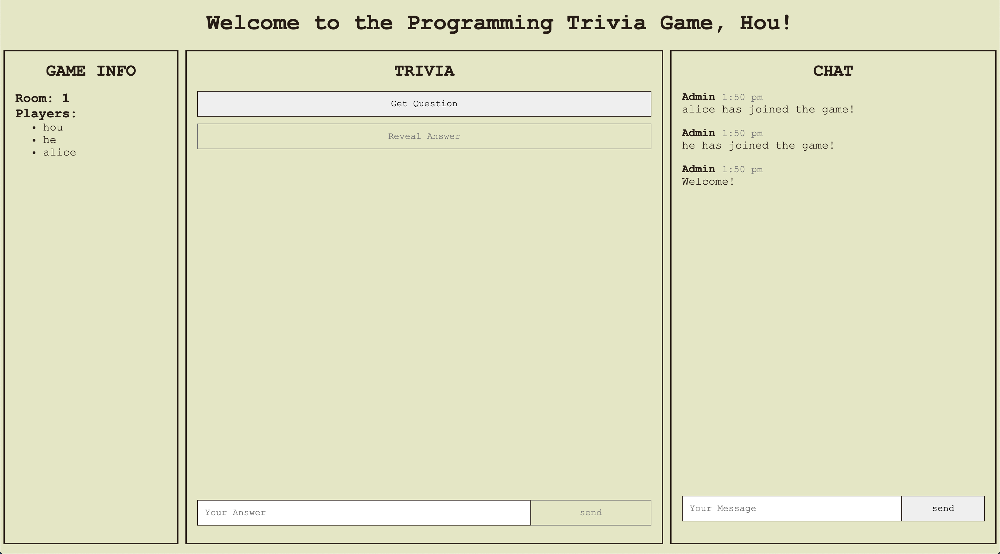

## Introduction

Welcome to the **final** part of the six-part [Introduction to Node.js tutorial series](/blog/introduction-to-node-js-tutorial-series-overview). By the end of this tutorial, you will be able to:

- create real-time, bi-directional, and event-based communication using a Socket.IO-powered Express server
- make HTTP requests from an Express server using the built-in `http` Node.js module and with [node-fetch](https://www.npmjs.com/package/node-fetch)

## Tutorial Outline

- Socket.IO Overview
- Client-Server Communication Protocols
- Building a Live Multi-Player Programming Trivia Game

  - Complete Example
  - Trivia Game Features
  - Task 1: Installing Express & Socket.IO
  - Task 2: Create a Basic Express Server
  - Task 3: Connect Socket.IO to Express Server
  - Task 4: Set Up Client-Side Files
  - Task 5: Create the Welcome Header
  - Task 6: Working with Socket.IO Events
    - Sending Events with `emit`
    - Add, Retrieve, and Remove Players from the Game
    - Receiving Events with `on`
  - Task 7: Letting Players Know a New Player Has Joined (`socket.broadcast.to`)
  - Task 8: Display the Game Info (`io.in.emit`)
  - Task 9 (**_CHALLENGE_**): Handle Player Disconnect
  - Task 10: Create Chat Functionality
  - Task 11: Display a Trivia Question for All Players
    - **_CHALLENGE_**: Update the Trivia Section with the Question Prompt
    - **_CHALLENGE_**: Refactor your HTTP Request to Use Node-Fetch
  - Task 12 (**_CHALLENGE_**): Allow Players to Submit an Answer to the Trivia
  - Task 13 (**_CHALLENGE_**): Allow Players to Reveal the Answer
  - **_CHALLENGE_**: Taking Your Game Further

- Additional Resources
- Review
- Key Takeaways
- What's next

## Socket.IO Overview

From the [Socket.IO](https://socket.io/) website:

_"Socket.IO enables real-time, bidirectional and event-based communication. It works on every platform, browser or device, focusing equally on reliability and speed."_

Socket.IO can be used to build a variety of applications that have real-time communication capabilities, such as streaming applications, document collaboration, and instant messaging.

In this tutorial, we will be building a Socket.IO-powered [multi-player trivia game](https://whispering-fjord-58285.herokuapp.com/).

## Client-Server Communication Protocols

AJAX polling, long polling, and WebSockets are popular communication protocols between a client (e.g., browser) and a web server.

Let's review each protocol type briefly, as it's important for understanding how Socket.IO works.

### AJAX Polling

- The client connects with the server and sends repeated HTTP requests at regular intervals (e.g., every second)
  - significant HTTP overhead!

<details><summary>AJAX Polling Notes</summary>
AJAX polling is a technique applied in AJAX applications where the client opens a connection with the server, and then repeatedly sends HTTP requests to a server at regular intervals (e.g., every 1 second) to get any new information that the server has.

After sending each request, the client waits for the server to respond, either with the data or with an empty response (if no data is available).

This technique significantly increases the HTTP overhead (e.g., creating HTTP headers, establishing and closing connections, generating a response, etc.) because the client has to keep bugging the server for new pieces of data, most of which are just empty responses.

</details>

### Long Polling

- The client opens a connection with the server, sends an initial HTTP request, and waits for a response from the server.

<details><summary>Long Polling Notes</summary>
In long polling, the client opens a connection with the server and makes an initial HTTP request but does not expect the server to respond immediately.

Instead of sending an empty response when information is not available, the server "hangs" or waits until data becomes available to push a response to the client or a timeout threshold is reached.

The client then immediately sends another HTTP request to the server, thereby ensuring that the server would always have a request waiting for it to respond to with any new data. This process is repeated as many times as needed.

The client may have to reconnect to the server periodically after the connection is closed due to timeouts.

</details>

### WebSockets

"WebSocket is a computer communications protocol, providing full-duplex communication channels over a single [Transmission Control Protocol](https://en.wikipedia.org/wiki/Transmission_Control_Protocol) connection" - [Wikipedia](https://en.wikipedia.org/wiki/WebSocket)

- The browser establishes a persistent session with the server via a `WebSocket handshake`.
- Socket.IO uses WebSocket as the transport mechanism if it's available in the browser, falling back on HTTP long polling if it's not.

<details><summary>WebSockets Notes</summary>
WebSocket creates a persistent, bi-directional communication session between the user's browser and a web server.

To establish a WebSocket connection, the browser contacts the server and asks for a WebSocket a connection (a process known as the [`WebSocket handshake`](https://developer.mozilla.org/en-US/docs/Web/API/WebSockets_API/Writing_WebSocket_servers#The_WebSocket_handshake)).

If the `handshake` succeeds, then the server and client can pass data back and forth at any time, as long as the connection remains open. Responses are event-driven, so there's no need to continually poll the server.

Socket.IO uses WebSocket as a transport when the [WebSocket API](https://developer.mozilla.org/en-US/docs/Web/API/WebSockets_API) is available in the browser, falling back on [HTTP long polling](#long-polling) if it's not. As of July 2020, [97%](https://caniuse.com/#search=websocket) of all browsers support WebSocket.

The Socket.IO client is a wrapper around the WebSocket API, whereas the Socket.IO server exposes a `socket` object that extends the Node.js [EventEmitter](https://nodejs.org/docs/latest/api/events.html#events_class_eventemitter) class.

Take a look at [this article](https://www.ably.io/concepts/websockets) if you're interested in a deep dive into WebSockets!

</details>

## Building a Live Multi-Player Programming Trivia Game

Let's build a live multi-player trivia game using Socket.IO! We'll learn about Socket.IO's various [API methods](https://socket.io/docs/emit-cheatsheet/) along the way.

### Trivia Game Features

The following features will be part of the game:

- Each player is required to enter a `name` and a `room` to join a game
- Multiple players can join a single channel/room. Multi-channel support is not part of MVP, so only one game can happen at a time
- Within the game channel/room,
  - players can chat with each other in real-time
  - players can view who else are in the room as well as the room they're currently in
  - any player can initiate a game
  - each player is allowed to submit only one response per player
  - each player must submit a response before the answer can be revealed

Here's the [deployed game](https://whispering-fjord-58285.herokuapp.com/) for your reference.

If you ever feel lost as you progress through the tutorial, you can always reference the commit link provided at the end of each task to compare your code against the completed version!

**You can find the code for the [completed project here](https://github.com/intro-to-nodejs/trivia-game).**

## Starter Code

There's no starter code for this tutorial. You will follow the steps described below to build the project from scratch.

### Complete Example

A Github repo with the complete code is available [here](https://github.com/kchia/starter-express-authentication).

### Task 1: Installing Express & Socket.IO

**_Here's a [commit](https://github.com/intro-to-nodejs/trivia-game/commit/69be457128ef92b5eae89d80f19f6c3ab76a4fac) showing the changes for task 1._**

1.  From your terminal, change into your course directory: `$ cd /path/to/your/course/directory`

1.  Create a new directory: `$ mkdir trivia-game`.

1.  Change into your `/trivia-game` directory: `$ cd trivia-game`.

1.  Turn your directory into an `npm` package and use the information extracted from the current directory to configure your `package.json`:

    ```
    $ npm init -yes
    ```

    Running this command creates a `package.json` file in your current directory.

1.  Install the required dependencies:

    ```
    $ npm install express socket.io
    ```

    Running this command creates a new folder called `node_modules` in your current directory.

1.  Add a `.gitignore` file to your current directory:

    ```
    $ touch .gitignore
    ```

    Add `node_modules` to the first line of the `.gitignore` file to avoid committing `node_modules` folder to Git.

### Task 2: Create a Basic Express Server

**_Here's a [commit](https://github.com/intro-to-nodejs/trivia-game/commit/cac665fab985698d9bf714371937a45c2d002922) showing the changes for task 2._**

1. Create a folder for storing our server-side code: `$ mkdir src`.

1. Create a file for configuring and starting our server: `$ touch src/index.js`.

1. Set up a basic Express server:

   ```js:title=src/index.js
   const express = require("express");
   const app = express();

   const port = process.env.PORT || 8080;
   app.listen(port, () => {
     console.log(`Server is up on port ${port}.`);
   });
   ```

1. Start up your application server: `$ nodemon src/index.js`. Your console should tell you that your server is up and running!

   

1. Create a `public/` folder in project folder: `$ mkdir public`.

1. Set up our server to serve static assets (e.g., HTML, CSS, and scripts for our game pages) to the client.:

   ```diff:title=src/index.js
   const express = require('express');
   +  const path = require('path');

   const port = process.env.PORT || 8080;

   const app = express();

   +  const publicDirectoryPath = path.join(__dirname, '../public');
   +  app.use(express.static(publicDirectoryPath));
   +
   app.listen(port, () => {
     console.log(`Server is up on port ${port}.`);
   });
   ```

### Task 3: Connect Socket.IO to Express Server

**_Here's a [commit](https://github.com/intro-to-nodejs/trivia-game/commit/de807c2837be916e19f050dbd69da7b5c2fcbca2) showing the changes for task 3._**

1. Connect Socket.IO to our Express server:

   ```diff:title=src/index.js
   const express = require('express');
   + const http = require('http');
   const path = require('path');
   + const socketio = require('socket.io');

   const port = process.env.PORT || 8080;

   const app = express();
   + const server = http.createServer(app); // create the HTTP server using the Express app created on the previous line
   + const io = socketio(server); // connect Socket.IO to the HTTP server

   const publicDirectoryPath = path.join(__dirname, '../public');
   app.use(express.static(publicDirectoryPath));

   + io.on('connection', () => { // listen for new connections to Socket.IO
   +  console.log('A new player just connected');
   + })

   - app.listen(port, () => {
   + server.listen(port, () => {
     console.log(`Server is up on port ${port}.`);
   });
   ```

### Task 4: Set Up Client-Side Files

**_Here's a [commit](https://github.com/intro-to-nodejs/trivia-game/commit/1890c958ecaeb69df59b340711afc34c5e673d83) showing the changes for task 4._**

Let's create the files that the client will need to render the game in the browser.

1. Create folders for our JavaScript files and CSS in `/public`: `$ mkdir public/js public/css`

1. Create the client-side files: `$ touch public/index.html public/trivia.html public/js/trivia.js public/css/styles.css`

   Your `public/` folder should look like this:

   

1. Since HTML & CSS are not the primary focus of the course, we will not create these from scratch! Just copy and paste the HTML (i.e., `public/index.html`, `public/trivia.html`) and CSS code (i.e., `public/css/styles.js`) from this [commit](https://github.com/intro-to-nodejs/trivia-game/commit/1890c958ecaeb69df59b340711afc34c5e673d83) into your own files. That said, feel free to tweak the styling to your liking!

   `public/index.html` and `public/trivia.html` contain the HTML code for the registration and game pages respectively.

   `public/trivia.html` includes a few essential third-party scripts for our game:

   - [Handlebars](https://handlebarsjs.com/)
   - [Moment.js](https://momentjs.com/)
   - [Client-Side Socket.IO](https://socket.io/docs/client-api/)

   ```html:title=public/trivia.html
   <!-- Handlebars: our client-side templating engine -->
   <script src="https://cdnjs.cloudflare.com/ajax/libs/handlebars.js/4.7.6/handlebars.min.js"></script>

   <!-- MomentJS: a library for formatting timestamps -->
   <script src="https://cdnjs.cloudflare.com/ajax/libs/moment.js/2.22.2/moment.min.js"></script>

   <!-- Client-Side Socket IO -->
   <script src="/socket.io/socket.io.js"></script>

   <!-- Custom JavaScript file where we write our game-related logic -->
   <script src="/js/trivia.js"></script>
   ```

   Socket.IO automatically serves up `/socket.io/socket.io.js` which contains the [client-side Socket.IO code](https://socket.io/docs/client-api/).

   `http://localhost:8080` should now display a registration page that includes a form which allows a player to input their `name` and `room`.

   

1. Fill out the form and hit `Join`. You should be taken to the game page.

   

   The app does not work yet because we haven't added any of the game logic!

### Task 5: Create the Welcome Header

Here's a [commit](https://github.com/intro-to-nodejs/trivia-game/commit/de129fc8d7636311e855cefcccf903cd6a50e549) showing the changes for task 5.

The welcome header is currently missing, so let's add that.

Notice in the completed game that the header greets the player by the name that they provided on the registration page. We can use [`Handlebars`](https://handlebarsjs.com/) to generate the header dynamically in the client!

1. Create the welcome header:

   ```js:title=public/js/trivia.js
   // Extract the playerName from the url search params, which the player provided on the registration page
   const urlSearchParams = new URLSearchParams(window.location.search);
   const playerName = urlSearchParams.get("playerName");

   // We'll follow the basic tasks below whenever we need to update the page with Handlebars.
   // Target the template which is embedded as a script tag in the `public/trivia.html` file
   const mainHeadingTemplate = document.querySelector(
     "#main-heading-template"
   ).innerHTML;

   // Compile the template into HTML by calling Handlebars.compile(), which returns a function
   const welcomeHeadingHTML = Handlebars.compile(mainHeadingTemplate);
   // Insert the welcomeHeadingHTML right after the opening <main> tag
   document.querySelector("main").insertAdjacentHTML(
     "afterBegin",
     // Invoke the welcomeHeadingHTML function, passing in the data that will be used to render the heading
     welcomeHeadingHTML({
       playerName,
     })
   );
   ```

### Task 6: Working with Socket.IO Events

**_Here's a [commit](https://github.com/intro-to-nodejs/trivia-game/commit/ba007b32b60951a0e17ba93a4d4b60828f6b54f8) showing the changes for task 6._**

Socket.IO uses `events` facilitate data transfer between the client and the server.

Every event consists of two sides: the **_sender_** and the **_receiver_**.

If the server is the sender, then the client is the receiver. If the client is the sender, then the server is the receiver.

#### Sending Events with `socket.emit`

Events can be sent from the sender using the `socket.emit` function. Let's send an event from the client to notify the server that a player has joined the game:

```diff:title=public/js/trivia.js
+ // io is provided by the client-side Socket.IO library that was loaded in public/trivia.html
+ const socket = io();

const urlSearchParams = new URLSearchParams(window.location.search);
const playerName = urlSearchParams.get('playerName');
+ // Extract the `room` value from the url, as we will need to use it below
+ const room = urlSearchParams.get('room');
.
.
.
+  // Call `socket.emit` to send an event to the server.
+    // The first argument describes the name of the event (i.e., `join`).
+    // The second argument contains the data (i.e., `playerName` and `room`) to be sent to the server along with the event.
+    // The third argument is a callback function that is invoked when the server acknowledges the event.
+    // If there's an error, the player will see an alert and be redirected back to the registration page
+
+ socket.emit('join', { playerName, room }, error => {
+  if (error) {
+    alert(error);
+    location.href = '/';
+  }
+ });
```

Navigate to `http://localhost:8080` on a few separate browser tabs. In your Node.js console, you should see a console message `A new player just connected` for each browser tab opened.


#### Add, Retrieve, and Remove Players from the Game

To keep our code modular and maintain separation of concerns, let's store all the code related to adding, retrieving, and removing players from a game in a separate file in the server.

Go ahead and create a new folder called `/utils` and a file called `/players.js` inside that folder:

```js:title=src/utils/players.js
const players = [];

// Add a new player to the game
const addPlayer = ({ id, playerName, room }) => {
  if (!playerName || !room) {
    return {
      error: new Error("Please enter a player name and room!"),
    };
  }

  // clean the player registration data
  playerName = playerName.trim().toLowerCase();
  room = room.trim().toLowerCase();

  const existingPlayer = players.find((player) => {
    return player.room === room && player.playerName === playerName;
  });

  if (existingPlayer) {
    return {
      error: new Error("Player name is in use!"),
    };
  }

  const newPlayer = { id, playerName, room };
  players.push(newPlayer);

  return { newPlayer };
};

// Get a player by id
const getPlayer = (id) => {
  const player = players.find((player) => player.id === id);

  if (!player) {
    return {
      error: new Error("Player not found!"),
    };
  }

  return { player };
};

// Get all players in the room
const getAllPlayers = (room) => {
  return players.filter((player) => player.room === room);
};

// Remove a player by id
const removePlayer = (id) => {
  return players.find((player, index) => {
    if (player.id === id) {
      return players.splice(index, 1)[0];
    }
    return false;
  });
};

// Export our helper methods
module.exports = {
  addPlayer,
  getPlayer,
  getAllPlayers,
  removePlayer,
};
```

**_ DISCUSS_**: In your breakout group, discuss what the helper functions in `src/utils/players.js` do.

Let's also create a function to format game messages so that they include timestamps which we will display along with the trivia answers and chat messages in the game.

```js:title=src/utils/formatMessage.js
module.exports = (playerName, text) => {
  return {
    playerName,
    text,
    createdAt: new Date().getTime(),
  };
};
```

Don't forget to import these helper functions in the main server file so we can use them later on:

```js:title=src/index.js
const formatMessage = require("./utils/formatMessage.js");

const {
  addPlayer,
  getAllPlayers,
  getPlayer,
  removePlayer,
} = require("./utils/players.js");
```

#### Receiving Events with `socket.on`

Events can be received by the receiver using `socket.on`.

In the server, listen for the `join` event within the connection event handler:

```diff:title=src/index.js
- io.on('connection', () => {
+ io.on('connection', socket => {
  console.log('A new player just connected');

+  // Call `socket.on` to listen to an event.
+  // The first argument describes the name of the event to listen to (i.e., `join`).
+  // The second argument is a callback that runs on receiving the event. This callback has access to two parameters.
+     // The first parameter represents a data object sent from the client along with the event.
+     // The second parameter is a callback function that can be called on the server to trigger the acknowledgement function on the client, a process called Event Acknowledgments
+
+  socket.on('join', ({ playerName, room }, callback) => {
+    const { error, newPlayer } = addPlayer({ id: socket.id, playerName, room });
+
+    // In this example, the callback is called with an error message
+    // if faulty regisration information was detected.
+    // The argument would get passed to the client where the error could be shown.
+    if (error) return callback(error.message);
+    callback(); // The callback can be called without data.
+
+    // The server is responsible for adding and removing players from a room.
+    // Call `socket.join` to subscribe the socket to a given room.
+    socket.join(newPlayer.room);
+
+    // Call `socket.emit` to send the new player a welcome message when the player joins a room
+    // We'll write code in the client later on to listen for the `message` event
+    // Call `formatMessage` to add format our message with timestamps
+    socket.emit('message', formatMessage('Admin', 'Welcome!'));
+  });
});
```

The client should listen for the `message` event and update the chat section accordingly whenever the `message` event is received:

```js:title=public/js/trivia.js
socket.on("message", ({ playerName, text, createdAt }) => {
  // target the container in the DOM where we'll attach the new message to
  const chatMessages = document.querySelector(".chat__messages");

  // target the Handlebars template we need to create a message
  const messageTemplate = document.querySelector("#message-template").innerHTML;

  // Compile the template into HTML by calling Handlebars.compile(),
  // which returns a function
  const template = Handlebars.compile(messageTemplate);

  const html = template({
    playerName,
    text,
    createdAt: moment(createdAt).format("h:mm a"),
  });

  // Insert the new html right at the beginning of chatMessages container
  chatMessages.insertAdjacentHTML("afterBegin", html);
});
```

Test your game page and make sure the `Welcome` message is displaying in the chat box at this point!


### Task 7: Letting Players Know a New Player Has Joined (`socket.broadcast.to`)

**_Here's a [commit](https://github.com/intro-to-nodejs/trivia-game/commit/1daf82b29f76adbed9e84fd94f1663573433dab6) showing the changes for task 7._**

Next, use `socket.broadcast.to` to send a `message` event to let all other players in the room know when a new player has joined the game.

```diff:title=src/index.js
io.on('connection', () => {
  console.log('A new player just connected');

  socket.on('join', ({ playerName, room }, callback) => {
    const { error, newPlayer } = addPlayer({ id: socket.id, playerName, room });

    if (error) return callback(error.message);

    socket.join(newPlayer.room);

    socket.emit('message', formatMessage('Admin', 'Welcome!'));

+    socket.broadcast
+      .to(newPlayer.room)
+      .emit(
+        'message',
+        formatMessage('Admin', `${newPlayer.playerName} has joined the game!`)
+      );
+
+  });

});
```

Navigate to `http://localhost:8080` and join the same room from several browser tabs. You should see the chat box update with a new message about the player who has just joined every time a new socket connects to the server.


### Task 8: Display the Game Info (`io.in.emit`)

**_Here's a [commit](https://github.com/intro-to-nodejs/trivia-game/commit/8eb0f7f192896ed8f19369be3f6a6fd234a5aa7a) showing the changes for task 8._**

The Game Info section displays the player's current room and the players who are active in that room. We can use the `io.in.emit` function to send an event (i.e., `room`) to all players in the room:

<details>
  <summary>
  What is the difference between `socket.broadcast.to` and `io.in.emit`?
  </summary>

`socket.broadcast.to` sends an event to all clients in the room except the sender whereas `io.in.emit` sends an event to all clients in the room

NOTE: `io.in.emit` and `io.to.emit` methods do the same thing!

</details>

```diff:title=src/index.js
io.on('connection', () => {
  console.log('A new player just connected');

socket.on('join', ({ playerName, room }, callback) => {
  const { error, newPlayer } = addPlayer({ id: socket.id, playerName, room });

  if (error) return callback(error.message);

  socket.join(newPlayer.room);

  socket.emit('message', formatMessage('Admin', 'Welcome!'));

  socket.broadcast
    .to(newPlayer.room)
    .emit(
      'message',
      formatMessage('Admin', `${newPlayer.playerName} has joined the game!`)
    );

+    // Emit a "room" event to all players to update their Game Info sections
+    io.in(newPlayer.room).emit('room', {
+      room: newPlayer.room,
+      players: getAllPlayers(newPlayer.room),
+    });
  });
});
```

We have to set up the client to listen for the `room` event and update the page (i.e., the Game Info section) accordingly on receiving the event:

```js:title=public/js/trivia.js
socket.on("room", ({ room, players }) => {
  // target the container where we'll attach the info to
  const gameInfo = document.querySelector(".game-info");

  // target the Handlebars template we'll use to format the game info
  const sidebarTemplate = document.querySelector(
    "#game-info-template"
  ).innerHTML;

  // Compile the template into HTML by calling Handlebars.compile(), which returns a function
  const template = Handlebars.compile(sidebarTemplate);

  const html = template({
    room,
    players,
  });

  // set gameInfo container's html content to the new html
  gameInfo.innerHTML = html;
});
```



### Task 9 (**_CHALLENGE_**): Handle Player Disconnect

**_Here's a [commit](https://github.com/intro-to-nodejs/trivia-game/commit/f41dc1efbd5389bcfe4403d5dbaa7bb74cc8aff0) showing the changes for task 9._**

Sometimes, players get frustrated and quit the game without saying a word!

Your challenge here is to write code to remove the player from the game, send a message to all other players in the room to let them know of the player's departure, and also update the players list in the Game Info section.

Use the [Socket.IO docs](https://socket.io/docs) to help you.

**_HINT_**: What event gets fired when a player disconnects from the game?

<details>
  <summary>
    SOLUTION
  </summary>

Listen for the `disconnect` event on the server. This event is automatically fired whenever a socket is disconnected.

```js:title=src/index.js
socket.on("disconnect", () => {
  console.log("A player disconnected.");

  const disconnectedPlayer = removePlayer(socket.id);

  if (disconnectedPlayer) {
    const { playerName, room } = disconnectedPlayer;
    io.in(room).emit(
      "message",
      formatMessage("Admin", `${playerName} has left!`)
    );

    io.in(room).emit("room", {
      room,
      players: getAllPlayers(room),
    });
  }
});
```

</details>

### Task 10: Create Chat Functionality

**_Here's a [commit](https://github.com/intro-to-nodejs/trivia-game/commit/b3720f57091ef5d5ec24ba3e8b9fccf25968c087) showing the changes for task 10._**

Let's allow players to communicate with each other in the chat box! In the client, add an event listener on the chat form:

```js:title=public/js/trivia.js
// First, target the chat form in the DOM
const chatForm = document.querySelector(".chat__form");

// Second, add an event listener on the chat form
// The first argument is the event to listen for (i.e., 'submit')
// The second argument is the callback function that is called when the event is triggered
chatForm.addEventListener("submit", (event) => {
  event.preventDefault();

  const chatFormInput = chatForm.querySelector(".chat__message");
  const chatFormButton = chatForm.querySelector(".chat__submit-btn");

  // Disable the chat form submit button to prevent the player from being able to submit multiple messages simultaneously
  chatFormButton.setAttribute("disabled", "disabled");

  // Extract the message that the player typed into the message box
  const message = event.target.elements.message.value;

  // Send an event to the server along with the player's chat message
  socket.emit("sendMessage", message, (error) => {
    // On event acknowledgement by the server, reset the chat form button
    chatFormButton.removeAttribute("disabled");
    chatFormInput.value = "";
    chatFormInput.focus();

    // Alert an error if an error is received
    if (error) return alert(error);
  });
});
```

In the server, listen for the `sendMessage` event and emit the message to all players:

```js:title=src/index.js
socket.on("sendMessage", (message, callback) => {
  const { error, player } = getPlayer(socket.id);

  if (error) return callback(error.message);

  if (player) {
    io.to(player.room).emit(
      "message",
      formatMessage(player.playerName, message)
    );
    callback(); // invoke the callback to trigger event acknowledgment
  }
});
```

### Task 11: Display a Trivia Question for All Players

**_Here's a [commit](https://github.com/intro-to-nodejs/trivia-game/commit/2faccc6961913b250f8f220d7b202eced1b56476) showing the changes for task 11._**

Next, when any of the player clicks on the `Get Question` button, the game should begin for all players in the room. The same trivia question should display in the "Trivia" section for all players.

<details>
  <summary>
    Where should we write the code for making the API call to get a trivia
    question from our Trivia API?
  </summary>
  In the server! Because we want the same question to be displayed for all players.
</details>

In the client, send an event called `getQuestion` to the server when any player clicks on the `Get Question` button:

```js:title=public/js/trivia.js
const triviaQuestionButton = document.querySelector(".trivia__question-btn");
triviaQuestionButton.addEventListener("click", () => {
  // pass null as the second argument because we're not sending any data to the server
  // alert the error if the server sends back an error
  socket.emit("getQuestion", null, (error) => {
    if (error) return alert(error);
  });
});
```

You will be using trivia questions from the [Open Trivia Database API](https://opentdb.com). Here's [an example](https://opentdb.com/api.php?amount=1&category=18) of a JSON response from the API.

As the players interact with the game, we'd have to keep track of different pieces of data, including storing the current question prompt and correct answer, as well as keeping track of how many answers have been submitted.

Let's create helper functions that allow us to manage and update our game data on the server:

```js:title=src/utils/game.js
const https = require("https");
const { getAllPlayers } = require("./players.js");

// An object containing data for the current game
const game = {
  // prompt keeps track of the current question and answer choices
  // to be displayed to the user
  prompt: {
    answers: "",
    question: "",
    createdAt: "",
  },
  status: {
    submissions: {}, // submissions keeps track of players' answer submissions
    correctAnswer: "", // the correct answer to the current question
    isRoundOver: false, // determines whether or not the answer can be revealed
  },
};

// Get information about the game
const getGameStatus = ({ event }) => {
  const { correctAnswer, isRoundOver } = game.status;

  if (event === "getAnswer" && isRoundOver) {
    return { correctAnswer };
  }
};

// Update the game status
const setGameStatus = ({ event, playerId, answer, room }) => {
  if (event === "sendAnswer") {
    const { submissions } = game.status;

    // Store only one response per player per round
    if (!submissions[`${playerId}`]) {
      submissions[`${playerId}`] = answer;
    }

    // Set isRoundOver to true when the number of submissions matches the total number of players.
    // Otherwise, set it to false
    game.status.isRoundOver =
      Object.keys(submissions).length === getAllPlayers(room).length;
  }

  return game.status;
};

// Calls the opentdb API to get a random programming trivia question
const setGame = (callback) => {
  // configure the url query params to get one question (i.e., amount=1)
  // in the programming category (i.e., category=18)
  const url = "https://opentdb.com/api.php?amount=1&category=18";
  let data = "";

  // Here, we use the built-in `https` module to make https requests.
  // We need to pass a callback that handles data received in chunks and ends the request.
  const request = https.request(url, (response) => {
    // Listen to the readable stream 'data' event and and process incoming chunks of data
    response.on("data", (chunk) => {
      data = data + chunk.toString();
    });

    // When the data stream ends, the stream 'end' event is called once
    response.on("end", () => {
      const { correct_answer, createdAt, incorrect_answers, question } =
        JSON.parse(data).results[0];

      game.status.submissions = {};
      game.status.correctAnswer = correct_answer;
      game.prompt = {
        answers: shuffle([correct_answer, ...incorrect_answers]),
        question,
      };

      // wrap the data in a callback for asynchronous processing
      callback(game);
    });
  });

  // Handle error by logging any error to the server console
  request.on("error", (error) => {
    console.error("An error", error);
  });
  request.end();
};

// Shuffles an array. Source: https://javascript.info/task/shuffle
const shuffle = (array) => {
  for (let end = array.length - 1; end > 0; end--) {
    let random = Math.floor(Math.random() * (end + 1));
    [array[end], array[random]] = [array[random], array[end]];
  }
  return array;
};

module.exports = {
  getGameStatus,
  setGameStatus,
  setGame,
};
```

**_ DISCUSS_**: In your breakout group, discuss what the helper functions in `src/utils/game.js` do.

The server will have to listen for the `getQuestion` event from the client and invoke `setGame` to get a programming trivia question and send it to all players in the room:

```js:title=src/index.js
socket.on("getQuestion", (data, callback) => {
  const { error, player } = getPlayer(socket.id);

  if (error) return callback(error.message);

  if (player) {
    // Pass in a callback function to handle the promise that's returned from the API call
    setGame((game) => {
      // Emit the "question" event to all players in the room
      io.to(player.room).emit("question", {
        playerName: player.playerName,
        ...game.prompt,
      });
    });
  }
});
```

#### **_CHALLENGE_**: Update the Trivia Section with the Question Prompt

Make the needed changes in the client to update the Trivia Section with the question prompt. Make sure the `Get Question` button is disabled after a question is displayed, as questions cannot be skipped by trying to get a new question.

<details>
  <summary>
  SOLUTION
  </summary>

In the client, listen for the `question` event and update the page accordingly with the question prompt.

```js:title=public/js/trivia.js
// We'll use this helper function to decode any HTML-encoded
// strings in the trivia questions
// e.g., "According to DeMorgan&#039;s Theorem, the Boolean expression (AB)&#039; is equivalent to:"
const decodeHTMLEntities = (text) => {
  const textArea = document.createElement("textarea");
  textArea.innerHTML = text;
  return textArea.value;
};

socket.on("question", ({ answers, createdAt, playerName, question }) => {
  const triviaForm = document.querySelector(".trivia__form");
  const triviaQuestion = document.querySelector(".trivia__question");
  const triviaAnswers = document.querySelector(".trivia__answers");
  const triviaQuestionButton = document.querySelector(".trivia__question-btn");
  const triviaFormSubmitButton = triviaForm.querySelector(
    ".trivia__submit-btn"
  );

  const questionTemplate = document.querySelector(
    "#trivia-question-template"
  ).innerHTML;

  // Clear out any question and answers from the previous round
  triviaQuestion.innerHTML = "";
  triviaAnswers.innerHTML = "";

  // Disable the Get Question button to prevent the player from trying to skip a question
  triviaQuestionButton.setAttribute("disabled", "disabled");

  // Enable the submit button to allow the player to submit an answer
  triviaFormSubmitButton.removeAttribute("disabled");

  const template = Handlebars.compile(questionTemplate);

  const html = template({
    playerName,
    createdAt: moment(createdAt).format("h:mm a"),
    question: decodeHTMLEntities(question),
    answers,
  });

  triviaQuestion.insertAdjacentHTML("beforeend", html);
});
```

</details>

Try clicking on the `Get Question` button on any of the players' tab. The same trivia question should appear in all tabs! You won't be able to submit an answer just yet.

#### **_CHALLENGE_**: Refactor your HTTP Request to Use Node-Fetch

**_Here's a [commit](https://github.com/intro-to-nodejs/trivia-game/commit/e7736be14ee61b131bad099d6693d0b393397778) showing the changes for this refactoring exercise._**

As you might have noticed, using the `https` module requires a significant amount of code to get it working.

`node-fetch` is a Node.js module that allows the server to use the `Fetch` API. Its syntax is much simpler. Let's refactor the `setGame` function in `src/utils/game.js` to use `node-fetch`.

Here's the [documentation](https://www.npmjs.com/package/node-fetch) for your reference. Don't forget to install and save the dependency to your `package.json` file!

```
$ npm install --save node-fetch
```

<details>
  <summary>
    SOLUTION
  </summary>

Note how much cleaner the syntax is!

</details>

### Task 12 (**_CHALLENGE_**): Allow Players to Submit an Answer to the Trivia

Here's a [commit](https://github.com/intro-to-nodejs/trivia-game/commit/c32a8dee732c7d91ef85855e1a2bc41fa058323c) showing the changes for task 12.

In the client, the trivia form should listen for a `submit` event. On `submit`, send the player's answer to the server.

Don't forget to disable the button after the player has submitted an answer, since we don't want to allow players to submit multiple answers.

<details>
  <summary>
    SOLUTION
  </summary>

```js:title=public/js/trivia.js
const triviaForm = document.querySelector(".trivia__form");
triviaForm.addEventListener("submit", (event) => {
  event.preventDefault();

  const triviaFormSubmitButton = triviaForm.querySelector(
    ".trivia__submit-btn"
  );
  const triviaFormInputAnswer = triviaForm.querySelector(".trivia__answer");

  triviaFormSubmitButton.setAttribute("disabled", "disabled");

  const answer = event.target.elements.answer.value;
  socket.emit("sendAnswer", answer, (error) => {
    triviaFormInputAnswer.value = "";
    triviaFormInputAnswer.focus();

    if (error) return alert(error.message);
  });
});
```

</details>

In the server, listen for and handle the `sendAnswer` event:

```js:title=src/index.js
// import setGameStatus function
const { setGame, setGameStatus } = require("./utils/game.js");

socket.on("sendAnswer", (answer, callback) => {
  const { error, player } = getPlayer(socket.id);

  if (error) return callback(error.message);

  if (player) {
    const { isRoundOver } = setGameStatus({
      event: "sendAnswer",
      playerId: player.id,
      room: player.room,
    });

    // Since we want to show the player's submission to the rest of the players,
    // we have to emit an event (`answer`) to all the players in the room along
    // with the player's answer and `isRoundOver`.
    io.to(player.room).emit("answer", {
      ...formatMessage(player.playerName, answer),
      isRoundOver,
    });

    callback();
  }
});
```

In the client, listen for the `answer` event and update the Trivia section with the data from the server:

```js:title=public/js/trivia.js
socket.on("answer", ({ playerName, isRoundOver, createdAt, text }) => {
  const triviaAnswers = document.querySelector(".trivia__answers");
  const triviaRevealAnswerButton = document.querySelector(
    ".trivia__answer-btn"
  );

  const template = Handlebars.compile(messageTemplate);

  const html = template({
    playerName: playerName,
    text,
    createdAt: moment(createdAt).format("h:mm a"),
  });

  triviaAnswers.insertAdjacentHTML("afterBegin", html);

  // If isRoundOver is set to true, activate the reveal answer button
  if (isRoundOver) {
    triviaRevealAnswerButton.removeAttribute("disabled");
  }
});
```

### Task 13 (**_CHALLENGE_**): Allow Players to Reveal the Answer

**_Here's a [commit](https://github.com/intro-to-nodejs/trivia-game/commit/da3ece3658693512e2756318905a21f059c4b787) showing the changes for task 13._**

Go ahead and allow any of the players to reveal the answer when the round is over (i.e., when each player has submitted an answer). Use `correctAnswer` as your event name.

<details>
  <summary>
    SOLUTION
  </summary>

In the client, emit a `getAnswer` event to the server:

```js:title=public/js/trivia.js
const triviaRevealAnswerButton = document.querySelector(".trivia__answer-btn");
triviaRevealAnswerButton.addEventListener("click", () => {
  socket.emit("getAnswer", null, (error) => {
    if (error) return alert(error);
  });
});
```

In the server, emit `correctAnswer` to all players along with the correct answer:

```js:title=src/index.js
socket.on("getAnswer", (data, callback) => {
  const { error, player } = getPlayer(socket.id);

  if (error) return callback(error.message);

  if (player) {
    const { correctAnswer } = getGameStatus({
      event: "getAnswer",
    });
    io.to(player.room).emit(
      "correctAnswer",
      formatMessage(player.playerName, correctAnswer)
    );
  }
});
```

Back in the client, listen for the `correctAnswer` event and display the correct answer in the trivia section.

```js:title=public/js/trivia.js
socket.on("correctAnswer", ({ text }) => {
  const triviaAnswers = document.querySelector(".trivia__answers");
  const triviaQuestionButton = document.querySelector(".trivia__question-btn");
  const triviaRevealAnswerButton = document.querySelector(
    ".trivia__answer-btn"
  );
  const triviaFormSubmitButton = triviaForm.querySelector(
    ".trivia__submit-btn"
  );

  const answerTemplate = document.querySelector(
    "#trivia-answer-template"
  ).innerHTML;
  const template = Handlebars.compile(answerTemplate);

  const html = template({
    text,
  });

  triviaAnswers.insertAdjacentHTML("afterBegin", html);

  triviaQuestionButton.removeAttribute("disabled");
  triviaRevealAnswerButton.setAttribute("disabled", "disabled");
  triviaFormSubmitButton.removeAttribute("disabled");
});
```

</details>

And there you have it! Your trivia game should now be fully functional. Congratulations!

## **_CHALLENGE_**: Taking Your Game Further

Did you finish the tutorial early? Here are a few suggestions on how to take your game to the next level!

- Implement support for multiple, concurrent channels. Our game logic currently only works properly for one active channel at a time, even though the players can join multiple channels.

- Implement an automated scoring system. Create a scoreboard that keeps track of players' scores. Declare a winner or tie after a certain number of rounds or score is reached in the game.

- Set a time limit within which players must submit an answer or they forfeit their round.

- Allow players to select rather than type an answer. Validate the answer prior to scoring.

- Improve and centralize error handling within the application.

- Generalize the game by allowing the players to select a [different trivia category besides programming](https://opentdb.com/api_config.php).

- [Deploy](https://developer.mozilla.org/en-US/docs/Learn/Server-side/Express_Nodejs/deployment) your game to Heroku to play with friends and family!

- Add a database to save game sessions and scores!

- Anything else you can think of!

## Review

Take a moment to reflect on what you’ve learned in this tutorial and answer the following questions:

- Explain the differences between AJAX Polling, Long Polling, and WebSockets.

- What is Socket.IO? Which of the above communication protocols does Socket.IO rely on?

- Explain how events work in Socket.IO.

## Key takeaways

- AJAX polling is a technique applied in AJAX applications where the client opens a connection with the server, and then repeatedly sends HTTP requests to a server at regular intervals (e.g., every 1 second) to get any new information that the server has.

- In long polling, the client opens a connection with the server and makes an initial HTTP request but does not expect the server to respond immediately.

- WebSocket creates a persistent, bi-directional communication session between the user's browser and a web server.

- Socket.IO can be used to build a variety of applications that have real-time communication capabilities, such as streaming applications, document collaboration, and instant messaging. Socket.IO uses WebSocket as a transport when the WebSocket API is available in the browser, falling back on HTTP long polling if it's not.

- Socket.IO uses events facilitate data transfer between the client and the server. Every event consists of two sides: the sender and the receiver. If the server is the sender, then the client is the receiver. If the client is the sender, then the server is the receiver.

## You did it!

Congratulations, you've reached the end of the Introduction to Node.js tutorial series!

## Want more content like this? [Subscribe](/subscribe) to get the latest updates in your inbox

## Share your feedback

What did you like or didn't like about this post? Let me know what worked well and what can be improved. Your feedback is much appreciated!

import FeedbackForm from "../../../../src/components/feedback";

<FeedbackForm />
